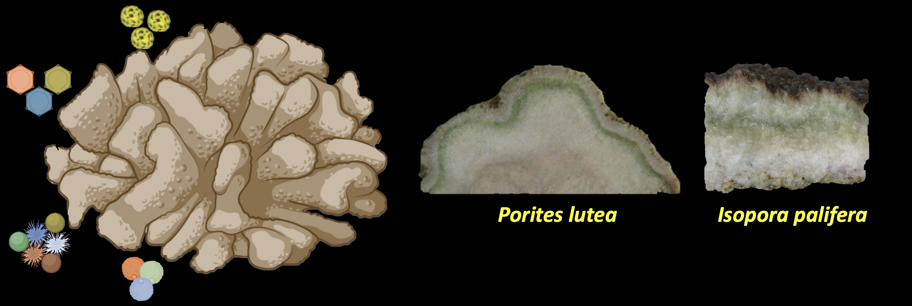

# About
This project is within the umbrella project funded by the Australian Research Council Discovery Project. In this project we have explored for the first time the transcriptionally active microbial and micro-eukaryotic community of stony coral <i>Porites lutea</i>, for more details please read the abstract or the manuscript below.
This repository hold the scripts used for making the figures for the manuscript "RNAseq sheds light on “who is doing what” in the coral <i>Porites lutea</i>"

## Abstract 
__Background__: The coral holobiont functions as a complex biogeochemical system, sustained by intricate metabolic exchanges between the host and its associated microbiome. While the taxonomic diversity of these communities is well documented, the specific metabolic roles and biogeochemical contributions of microorganisms across distinct coral compartments, particularly within the endolithic habitats, remain poorly understood. Using RNA-seq, we investigated the active microbiome of healthy stony coral Porites lutea, focusing on the coral tissue, the green endolithic algal layer (Ostreobium layer), and the deeper coral skeleton.

__Results__
We identified distinct, metabolically active communities within these compartments and highlight substantial metabolic redundancy across carbon, nitrogen, and sulfur pathways. Our study provides the first transcriptomic evidence of Ostreobium’s ability to transfer fixed carbon to other holobiont members and the coral host. We highlight the critical roles of diverse coral holobiont members in nutrient cycling and maintaining homeostasis through scavenging of reactive oxygen and nitrogen species.

__Conclusions__
This study provides a novel molecular-level understanding of the functional roles played by diverse coral holobiont members in their respective compartments and underscores that corals harbor distinct microbiomes with wide-ranging functions.

## Manuscript Status

- Preprint available at [bioRxiv](https://www.biorxiv.org/content/10.1101/2025.01.09.632055v2)

- Manuscript is now published in [Microbiome](https://link.springer.com/article/10.1186/s40168-026-02414-9)

## Data availabilty 
Raw sequencing data are deposited in the NCBI Sequence Read Archive (SRA) under BioProject PRJNA1207708.
